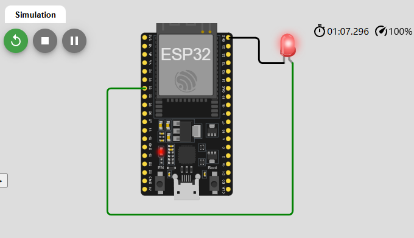

# Atividade Semanal 9 - Aplicação de Microprocessadores

| Autor                          | NUSP      |
| ------------------------------ | --------- |
| Aruan Bretas de Oliveira Filho | 12609731  |
| Johnatas Santos                | 13676388  |
| Gabriel Garcia                 | 13677160  |


## Simulações:

1. **LED_Blink**

```c++
#include <Arduino.h>

#define ledpin 32
void setup() { // configurações

pinMode(ledpin, OUTPUT); // pino 2 como saída (LED onboard da ESP32)
digitalWrite(ledpin,LOW); // escreve na saída  valor LOW (LED inicialmente desligado)

}

void loop() { // programa principal
  

digitalWrite(ledpin, HIGH);  // liga o LED (escreve valor lógio HIGH na saída - pino 2)
delay(500); // delay de 200 ms (Tempo que o LED fica ligado)
digitalWrite(ledpin, LOW); // desliga o LED (escreve valór lógico LOW na saída - pino 2)
delay(500); // delay de 200 ms (Tempo que o LED fica desligado)
// loop

}
```



Aqui vemos a luz alternar de seu modo atual a cada 500ms, ou seja, de acesa para apagado e vice-versa


2. **Timer_Interrupt**

```c++
#include <Arduino.h>  // Inclui a biblioteca Arduino para usar suas APIs no simulador Wokwi

const int ledPin = 2;         // Define o pino do LED como GPIO2
const int buttonPin = 13;      // Define o pino do botão como GPIO4

hw_timer_t *timer = NULL;  

volatile bool startBlink = false;  
void IRAM_ATTR onButtonPress() {  // Função de interrupção externa de GPIO para lidar com o pressionamento do botão
  startBlink = true;  // Define a flag como verdadeira quando o botão é pressionado
}

void IRAM_ATTR onTimer() {  // Função de interrupção para lidar com o temporizador
  digitalWrite(ledPin, !digitalRead(ledPin));  // Inverte o estado do LED
}


void setup() {
  Serial.begin(115200);  // Inicializa a comunicação serial com uma taxa de transmissão de 115200 bauds
  pinMode(ledPin, OUTPUT);  // Configura o pino do LED como saída
  pinMode(buttonPin, INPUT_PULLUP);  // Configura o pino do botão como entrada com pull-up interno


// Configuração da interrupção externa GPIO (botão)
  attachInterrupt(digitalPinToInterrupt(buttonPin), onButtonPress, FALLING);  
  timer = timerBegin(0, 80, true);  

  timerAttachInterrupt(timer, &onTimer, true);  

  timerAlarmWrite(timer, 500000, true);  
  // Define o valor de comparação do temporizador para 500.000 microssegundos (500 ms)
}

void loop() {
  if (startBlink) {  

    timerAlarmEnable(timer);  // Ativa o temporizador para piscar o LED
  } else {
    timerAlarmDisable(timer);  // Desativa o temporizador caso contrário
    digitalWrite(ledPin, LOW);  // e deixa o LED desligado 
  }
}
```


Aqui temos um projeto que controla o "piscar" da luz através de um botão.


## Comparação entre Recursos da ESP32 e PIC18F4550

### Timers
- **ESP32:** 
  - Timers são usados para contar eventos ou gerar atrasos.
  - Altamente configuráveis, permitindo precisão de microssegundos.
  - Podem ser configurados em modo de interrupção para executar ações periódicas automaticamente.

- **PIC18F4550:** 
  - Timers de 8 ou 16 bits com funcionalidade limitada.

---

### Interrupções
- **ESP32:** 
  - Suporta múltiplas fontes de interrupção, como GPIO, timers, UART, e ADC.
  - Gerenciadas por uma unidade de prioridade que garante execução eficiente e ordenada.

- **PIC18F4550:** 
  - Sistema básico com menor flexibilidade.

---

### ADC (Conversor Analógico-Digital)
- **ESP32:** 
  - Possui múltiplos canais ADC de 12 bits.
  - Pode ser configurado para leitura contínua ou pontual.
  - Suporte a calibração automática para maior precisão.

- **PIC18F4550:** 
  - ADC de 10 bits, menos preciso.

---

### DAC (Conversor Digital-Analógico)
- **ESP32:** 
  - Oferece dois canais DAC integrados de 8 bits.
  - Útil para gerar sinais analógicos a partir de valores digitais, como em aplicações de geração de áudio.

- **PIC18F4550:** 
  - Não possui DAC integrado, necessitando de circuitos externos para essa funcionalidade.

---

### Conclusão
As diferenças entre a ESP32 e o PIC18F4550 refletem o avanço da ESP32 como um microcontrolador moderno, com mais recursos integrados e maior flexibilidade.
