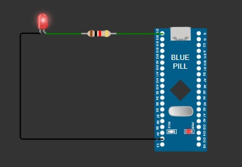

# Atividade Semanal 9 - Aplicação de Microprocessadores

| Autor                          | NUSP      |
| ------------------------------ | --------- |
| Aruan Bretas de Oliveira Filho | 12609731  |
| Johnatas Santos                | 13676388  |
| Gabriel Garcia                 | 13677160  |


## Comparativo entre PIC18F4550, STM32F103C8T6, e ESP32 WROOM 

| **Categoria**                | **PIC18F4550**                                                                                     | **STM32F103C8T6**                                                                                      | **ESP32 WROOM**                                                                                                       |
|------------------------------|----------------------------------------------------------------------------------------------------|--------------------------------------------------------------------------------------------------------|-----------------------------------------------------------------------------------------------------------------------|
| **Arquitetura e Desempenho** | Arquitetura RISC com modelo Harvard<br>Clock máximo: 40 MHz<br>Aplicações simples a moderadas      | Arquitetura ARM Cortex-M3 (32 bits)<br>Clock máximo: 72 MHz<br>Ideal para aplicações mais complexas     | Dual-Core Xtensa LX6 (32 bits)<br>Clock máximo: 240 MHz (160 MHz típico)<br>Excelente para IoT e processamento de dados |
| **Memória**                  | Flash: 44 KB<br>RAM: 4 KB<br>Suficiente para aplicações menores                                   | Flash: 64 KB<br>RAM: 20 KB<br>Adequada para aplicações mais complexas                                  | Flash: 432 KB (ROM)<br>RAM: 520 KB<br>Suporte a Flash externa via SPI<br>Abundante para IoT e processamento intensivo   |
| **Periféricos**              | ADC de 10 bits (8 canais)<br>USART, I2C, SPI, PWM (CCP)<br>Timers: 8 e 16 bits<br>GPIOs limitados | ADC de 12 bits (16 canais)<br>Vários USART, I2C, SPI<br>Timers: 16 e 32 bits<br>USB OTG<br>GPIOs abundantes | ADC de 12 bits<br>Wi-Fi e Bluetooth integrados<br>Touch sensing<br>Hall sensor<br>RTC integrado<br>PWM, I2C, SPI, UART |
| **Consumo de Energia**       | Baixo consumo em modos de baixa potência<br>Adequado para bateria, mas com flexibilidade limitada | Modos de baixa potência eficientes<br>Maior consumo em operação full-speed devido à arquitetura 32 bits | Excelente para baixa potência, especialmente com Wi-Fi e Bluetooth<br>Ideal para IoT com bateria                      |
| **Desenvolvimento e Ferramentas** | MPLAB X IDE<br>Compilador Microchip XC8 gratuito<br>Boa comunidade<br>Curva de aprendizado mais íngreme | STM32CubeIDE e Arduino IDE<br>Compilador GCC gratuito<br>Grande comunidade e documentação               | Arduino IDE e ESP-IDF<br>Compilador GCC gratuito<br>Popular na comunidade IoT com muitas bibliotecas disponíveis        |
| **Custo**                    | Econômico, ideal para baixo orçamento<br>Mais acessível em grandes quantidades                   | Ligeiramente mais caro que o PIC18F4550<br>Bom custo-benefício pelos recursos oferecidos                | Mais caro devido à integração Wi-Fi e Bluetooth<br>Justificado para aplicações IoT                                     |
|                |

### Conclusão
- *PIC18F4550:* Ideal para aplicações simples, com orçamento limitado e onde a simplicidade é um fator crítico.
  
- *STM32F103C8T6:* Uma escolha versátil para uma ampla gama de aplicações, oferecendo um bom balanceamento entre desempenho, recursos e custo.
  
- *ESP32 WROOM:* A melhor escolha para aplicações IoT que requerem conectividade sem fio, oferecendo uma combinação poderosa de desempenho, recursos e eficiência energética.

Cada microcontrolador tem suas próprias vantagens e desvantagens, e a escolha depende das necessidades específicas do projeto.

## Demonstração referente a Blink LED na placa BluePill



```c
void setup() {
  pinMode(PB12, OUTPUT);
}

void loop() {
  digitalWrite(PB12, LOW);
  delay(700);
  digitalWrite(PB12, HIGH);
  delay(700);
}
```

## Demonstração de como acionar a saída PC13, a partir da programação "bare-metal"

**Programação Bare-Metal:** Nesse contexto, "bare-metal" significa que o programa interage diretamente com o hardware do microcontrolador, sem o auxílio de um sistema operacional ou uma biblioteca de alto nível. O programador tem controle total sobre cada aspecto do funcionamento do microcontrolador.

```c
#include "stm32fixx.h"

int main(){

    RCC->APB2ENR = 0x00000008;
    GPIOB->CRH = 0x00020000;
    GPIOB->ODR = 0x00001000;
}
```

### Explicação:

- **RCC** é um ponteiro para o registrador de controle de clock do microcontrolador.
APB2ENR é um campo dentro desse registrador que controla a habilitação dos clocks para os periféricos conectados ao barramento APB2.
Ao atribuir o valor hexadecimal 0x00000008, estamos habilitando o clock para a porta GPIOB.

- **GPIOB** é um ponteiro para o registrador de controle da porta GPIOB.
    - **CRH** é um campo dentro desse registrador que configura os pinos da porta GPIOB.
    O valor hexadecimal 0x00020000 configura o pino 13 da porta GPIOB como saída de propósito geral.
    - **ODR** é o registrador de dados de saída da porta GPIOB.
    Ao atribuir o valor hexadecimal 0x00001000, estamos setando o pino 13 da porta GPIOB para o nível lógico alto.