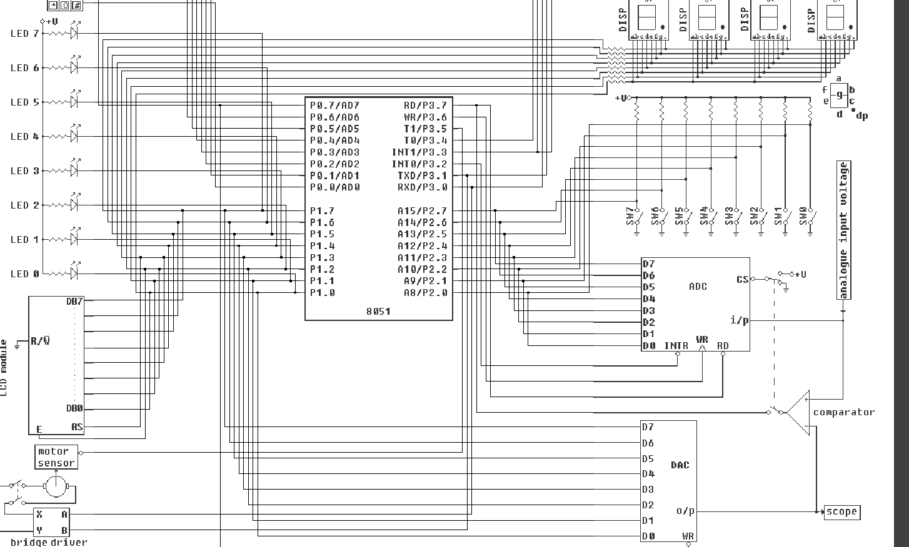

# Projeto 1 - Cronômetro Digital usando Assembly e 8051

## Sobre o Programa

Desenvolvimento de um Cronômetro Digital usando a linguagem Assembly para 8051 no simulador EdSim51. Para isso foi utilizado contagem de tempo, detecção de eventos, sub-rotinas, portas de entrada e saidas, e interfaces externas (botões, LEDs e displays de 7 segmentos). O cronômetro exibe os números de 0 a 9 em um display de 7 segmentos, alterando o seu tempo de espera entre 1s e 0,25s.

## Tabela 7 Segmentos

A tabela abaixo mostra os valores hexadecimais e binarios que permitem acionar cada segmento do display para representar os números de 0 a 9 em um display de 7 segmentos, como o exemplo abaixo.


| Dígito | Valor Hexadecimal | Valor Binário  |
|--------|-------------------|----------------|
| 0      | 0C0h              | 11000000       |
| 1      | 0F9h              | 11111001       |
| 2      | 0A4h              | 10100100       |
| 3      | 0B0h              | 10110000       |
| 4      | 99h               | 10011001       |
| 5      | 92h               | 10010010       |
| 6      | 82h               | 10000010       |
| 7      | 0F8h              | 11111000       |
| 8      | 80h               | 10000000       |
| 9      | 90h               | 10010000       |

Eles foram utilizados no código a fim de que pudesse mapear cada número a seus respectivos segmentos, e dessa forma poder interagir com as interfaces externas
## Explicação Estrutural

1. **Inicialização dos Registradores**:  
   ```
    ; Inicialização dos registradores
    MOV R2, #00  ; Inicializa R2 com 0 (contador)
    MOV R3, #2   ; Inicializa R3 com 2 (registrador usado para   guardar o valor atual do delay)
    MOV R4, #00  ; Inicializa R4 com 0 (flag para botão SW0 ou SW1 estiver pressionado)

    JMP espera  ; Pula para "espera" para aguardar o inicio do      programa

   ```
   O código começa definindo os registradores e preparando o microcontrolador:
   - `MOV R2, #00`: Inicializa o registrador `R2` como 0, que é usado como contador.
   - `MOV R3, #2`: Define `R3` como 2, que é o valor inicial do delay usado na contagem.
   - `MOV R4, #00`: Inicializa `R4` como 0, que serve como uma flag para verificar se um botão foi pressionado.


2. **Loop de Espera**:  
    ```assembly
        espera:
            JNB P2.1, main  ; Verifica se o botão P2.1 estiver pressionado, pulando para o programa principal
            JNB P2.0, main  ; Verifica se o botão P2.0 estiver pressionado, pulando para o programa principal
            JMP espera      ; Repete a verificação dos botões
    ```
    A loop de `espera` é responsável por aguardar que um dos botões (conectados a `SW0` ou `SW1`) seja pressionado para iniciar o cronômetro. O loop verifica continuamente o estado dos pinos e só sai quando ocorre o evento de um botão sendo pressionado.


3. **Loop Principal (`main`)**:  
    ```
    main:
        MOV DPTR, #display  ; Carrega o endereço base da tabela de display em DPTR
        MOV A, R2           ; Move o valor de R2 para o acumulador (A)
        MOVC A, @A+DPTR     ; Obtém o valor correspondente ao dígito atual da tabela de display
        MOV P1, A           ; Exibe o valor no display conectado ao P1

        JNB P2.1, seta_bit  ; Se o botão P2.1 não estiver pressionado, pula para "seta_bit"
        JNB P2.0, seta_bit  ; Se o botão P2.0 não estiver pressionado, pula para "seta_bit"

        MOV A, R4           ; Verifica o valor de R4
        JNZ checa_ou_troca  ; Se R4 não for zero, pula para "checa_ou_troca"

        CALL delay          ; Usa a sub-rotina de delay para aguardar o proximo digito
        CALL aum_contador   ; Usa a sub-rotina para incrementar o contador

        JMP main            ; Retorna ao início do loop principal
    ```
    A rotina main permite que usando a tabela de 7 segmentos, seja carregada a partir do valor no contador `R2`, o valor hexadecimal correspondente. Após isso, é verificado se o `SW0` ou `SW1` está sendo pressionado. Se estiver é setado um bit para o contador `R4`. Senão, verifica-se se é possivel chamar a sub-rotina `checa_ou_troca` a qual verifica o antigo valor entre 1s ou 0,25s e troca para o seu alternativo. Além disso, é responsável também por usar as sub-rotinas `aum_contador` e `delay`.

4. **Incremento do Contador**:  
    ```
    aum_contador:
        INC R2              ; Incrementa o valor de R2 (contador)
        CJNE R2, #0Ah, fim_reset  ; Compara R2 com 10; se não for igual, pula para "fim_reset"
        CALL reset_se_nove  ; Se for igual, chama a sub-rotina para resetar o contador

    fim_reset:
        RET                 ; Retorna da sub-rotina

    reset_se_nove:
        MOV R2, #00         ; Reseta R2 para 0
        RET                 ; Retorna da sub-rotina
    ```

   A sub-rotina `aum_contador` incrementa `R2` até quando o valor atinge o valor 10. Nesse momento a sub-rotina `reset_se_nove` é chamada para resetar `R2` a 0. 

5. **Delay**:  
   ```
    delay:
        MOV A, R3           ; Move o valor de R3 para o acumulador (A)
        MOV R0, A           ; Move o valor de A para R0 (contador de delay)
        MOV r1, #250		  ; Move para o registrador r1 para criar um ciclo
        mov r5, #250 		  ; Move para o registrador r1 para criar um ciclo
        
    delay_loop:
        DJNZ r1, delay_loop
        DJNZ r5, delay_loop
        DJNZ R0, delay_loop ; Decrementa R0 e repete o loop até que R0 seja zero
        RET                 ; Retorna da sub-rotina

   ```
   A sub-rotina `delay` usa o registrador `R3` para receber o valor atual necessário para que seja aguardado até a proxima função. Dessa forma, cria-se uma pausa, possibilitando que os valores sejam mostrados apartir de um intervalo fixo. 

    Foi usado 3 registradores da seguinte forma, o registrador `R3` variando entre 2 e 8. Assim, usando `R1 = 250` e `R5 = 250`. Assim $C = 250 * 250 * R3$ sendo $C = 125.000 ciclos$ ou $C = 500.ciclos$. O que permite que a variança de tempo seja $\Delta t = 125.000 * 2 \mu s = 0,25s$ ou $\Delta t = 500.000 * 2 \mu s = 1s$

6. **Checagem e Troca**:
   ```
   checa_ou_troca:
        MOV A, R3           ; Move o valor de R3 para o acumulador (A)
        CJNE A, #2, diferente  ; Compara A com 2; se não for igual, pula para "diferente"
        MOV R3, #8          ; Se for igual, define R3 como 8
        MOV R4, #0          ; Reseta R4
        JMP main            ; Retorna ao início do loop principal

    diferente:
        MOV R3, #2         ; Define R3 como 2
        MOV R4, #0          ; Reseta R4
        JMP main            ; Retorna ao início do loop principal

    seta_bit:
        MOV R4, #1          ; Define R4 como 1 para indicar que um botão foi pressionado
        JMP main            ; Retorna ao início do loop principal
    ```  
   A sub-rotina `checa_ou_troca` verifica o valor de `R3`. Se for igual a 2, troca 8 e vice-versa. Além disso, também reseta o registrador `R4`,  a qual é usado para saber quando um botão foi clicado. Deixando uma flag para verificar se foi alterado conforme necessário

## Diagrama Esquemático

O diagrama esquemático do circuito é composto por:
- **Microcontrolador 8051**: Responsável pelo controle do cronômetro e leitura dos botões.
- **Botões (SW0 e SW1)**: Conectados aos pinos `P2.0` e `P2.1` para iniciar e pausar a contagem.
- **Display de 7 Segmentos**: Conectado ao porto `P1` do microcontrolador para exibir os números.




| Autor                          | NUSP      |
| ------------------------------ | --------- |
| Aruan Bretas de Oliveira Filho | 12609731  |
| Johnatas Santos                | 13676388  |
| Gabriel Garcia                 | 13677160  |