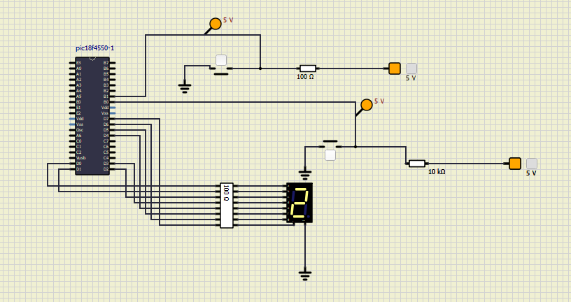

# Projeto 2 - Cronômetro Digital com Timer e Interrupções

## Sobre o Programa 

Desenvolvimento de um Cronômetro Digital usando a  programação básica de registradores SFR,
I/O, e periféricos dos microcontroladores PIC18F em linguagem C. Para isso, foi implementado funcionalidades de microcontroladores
em linguagem C, tais como timers, interrupções, I/O e interface com display de 7
segmentos. O cronômetro exibe os números de 0 a 9 em um display de 7 segmentos, alterando o seu tempo de espera entre 1s e 0,25s. Além disso, foi usado implementado o projeto no kit EasyPIC v7 e realizado simulações por meio do software
SimulIDE.


## Tabela 7 Segmentos

A tabela abaixo mostra os valores hexadecimais e binarios que permitem acionar cada segmento do display para representar os números de 0 a 9 em um display de 7 segmentos, como o exemplo abaixo.


| Dígito | Valor Hexadecimal | Valor Binário  |
|--------|-------------------|----------------|
| 0      | 0C0h              | 11000000       |
| 1      | 0F9h              | 11111001       |
| 2      | 0A4h              | 10100100       |
| 3      | 0B0h              | 10110000       |
| 4      | 99h               | 10011001       |
| 5      | 92h               | 10010010       |
| 6      | 82h               | 10000010       |
| 7      | 0F8h              | 11111000       |
| 8      | 80h               | 10000000       |
| 9      | 90h               | 10010000       |

Eles foram utilizados no código a fim de que pudesse mapear cada número a seus respectivos segmentos, e dessa forma poder interagir com as interfaces externas

## Explicação Estrutural 

1. **Configuracao do MCU**

```c
void ConfigMCU() // fun??o de config. do microcontrolador
{
  // Configurando os pinos como digitais
  ADCON1 |= 0x0F;

  // Config. das portas
  TRISD = 0; // PORTD como saida  (usar LED)
  PORTD = 0; // LED inicialmente OFF

  INTCON2.RDPU = 0; // ativa os pinos usados terão resistores de pull-up (chave para cima) 
}
```
Sua principal função é configurar inicicalmente o microcontrolodor. Para isso, altera os pinos como digitais. Alem disso, os pinos usados terão resistores de pull-up (chave para cima) 


2. **Configuração das interrupções**

```c
void INTERRUPCAO_HIGH() iv 0x0008 ics ICS_AUTO
{
  // vetor de tratamento da interrup??o (endereco fixo 0x0008)
  // Definir em Tools > Interrupt Assistant
  // HIGH = interrupcao de alta prioridade
  // LOW = interrupcao de baixa prioridade (endereco 0x0018)
  // ics = servico de acionamento/tratamento da interrup??o

  // tratamento - acionar LED
  if (INTCON.INT0IF == 1) // verifica se a INT0 ocorreu
  {                       // se sim:
    T0CON.TMR0ON = 0;     // Desliga o contador TMR0 p/ configuração
    T0CON = 0B00000100;   // TIMER_OFF, MOD_16BITS, TIMER, PRES_1:32

    INTCON.INT0IF = 0; //  zera flag (precisa sempre zerar manualmente para que o
                       // programa volte a sua execucao normal e trate novas interrupcoes
    T0CON.TMR0ON = 1;  // Liga o contador TMR0 após a configuração
  }
  if (INTCON3.INT1IF == 1) // verifica se a INT1 ocorreu
  {
    T0CON.TMR0ON = 0;   // Desliga o contador TMR0 p/ configuração
    T0CON = 0B00000010; // TIMER_OFF, MOD_16BITS, TIMER, PRES_1:8

    INTCON3.INT1IF = 0; //  zera flag
    T0CON.TMR0ON = 1;   // Liga o contador TMR0 após a configuração
  }
}
```

Para configurar o timer para gerar uma interrupção a cada 1 segundo, é necessário carregar um valor inicial nos registradores `TMR0H` e `TMR0L` para que o timer faça a contagem de forma correta. O cálculo do valor inicial a ser carregado é feito usando a fórmula a seguir:

### Cálculo com Prescaler de 32

Dado:
- **Ciclo de Máquina (Tc)** = 0,5 µs
- **Tempo desejado (T)** = 1 segundo (1.000.000 µs)
- **Modo do Timer0**: 16 bits (65536 valores possíveis)
- **Prescaler**: 32

A fórmula do tempo de overflow continua sendo:
$$
T = Tc \times \text{Prescaler} \times (\text{Modo} - \text{Valor Inicial})
$$

Substituindo:

$$
1000000 = 0,5 \, \mu s \times 32 \times (65536 - \text{Valor Inicial})
$$

* Simplificando:
   $$
   \frac{1000000}{0,5 \times 32} = 65536 - \text{Valor Inicial}
   $$
   $$
   62500 = 65536 - \text{Valor Inicial}
   $$
   $$
   \text{Valor Inicial} = 65536 - 62500 = 3036
   $$

* Convertendo para hexadecimal:
   $$
   3036 = 0x0BDC
   $$

    Portanto, os valores a serem carregados no `TMR0` são:
    - **TMR0H = 0x0B**
    - **TMR0L = 0xDC**

De forma análoga, fez os cálculos usando o $0,25s$ e notou-se que alterando o pre-scaler para 1:8, há a mesma carga inicial o que foi útil para reutilizar código.

3. **Configurar Interrupção Inicialmente**

```c
void ConfigInterrupt()
{
  INTCON.GIE = 1; // Chave Geral, Habilita o uso de interrupcao
  RCON.IPEN = 0;  // 0 -> (default) heranaa da fam?lia PIC16F, onde existe apenas

  INTCON.INT0IF = 0; // zera flag de interrupcao INT0
  INTCON.INT0IE = 1; // habilita interrupcao INT0

  INTCON3.INT1IE = 1; // habilita interrupcao INT1
  INTCON3.INT1IP = 1; // coloca INT1 como alta prioridade
  INTCON3.INT1IF = 0; // zera flag de interrupcao INT1

  INTCON2.INTEDG1 = 1; // configura INT1 para borda de subida
  INTCON2.INTEDG0 = 1; // configura INT0 para borda de subida

  TRISB.RB0 = 1; // Pino RB0/INT0 como entrada
  TRISB.RB1 = 1; // Pino RB1/INT1 como entrada
}
```
O objetivo dessa função são:

* Ativar a chave global
* Ativar as chaves de INT0 e INT1
* Zerar os registradores de INT0 e INT1
* Configurar as chaves para ser ativado para a borda de subida
* Ativar os pinos para receber a entrada


4. **Configurar Contador**

```c
signed char ucContador = -1; // var global  para incremento

void Incremento(unsigned char Contador) // Bloco de incremento
{
  switch (Contador)
  {
  case 0:
  {
    latd = 0b00111111;
    break;
  } // 0 no display de 7 seg.
  case 1:
  {
    latd = 0b00000110;
    break;
  } // 1 no display de 7 seg.
  case 2:
  {
    latd = 0b01011011;
    break;
  } // 2 no display de 7 seg.
  case 3:
  {
    latd = 0b01001111;
    break;
  } // 3 no display de 7 seg.
  case 4:
  {
    latd = 0b01100110;
    break;
  } // 4 no display de 7 seg.
  case 5:
  {
    latd = 0b01101101;
    break;
  } // 5 no display de 7 seg.
  case 6:
  {
    latd = 0b01111101;
    break;
  } // 6 no display de 7 seg.
  case 7:
  {
    latd = 0b00000111;
    break;
  } // 7 no display de 7 seg.
  case 8:
  {
    latd = 0b01111111;
    break;
  } // 8 no display de 7 seg.
  case 9:
  {
    latd = 0b01101111;
    break;
  } // 9 no display de 7 seg.
  case 10:
  {
    latd = 0b00111111;
    ucContador = 0;
    break;
  } // 0 no display de 7 seg. e reinicia contador
  default:
  {
    ucContador = -1;
    break;
  } // zera PORTD e reinicia contador
  }
}

```
Essa função é configurar o display de 7 segmentos a partir do valor de cada contador. Além disso, reseta o contador, depois de alcançar o valor 10


5. **Função Main**

```c

void main()
{

  // chamada das fucoes definidas anteriormente
  ConfigMCU();
  ConfigTIMER();
  ConfigInterrupt();

  while (1)
  {
    if (INTCON.TMR0IF == 1)     // verifica Se houve o "overflow" da contagem
    {                           // se sim:
      Incremento(++ucContador); // recebe o Incremento do contador p/ o display de 7 segmentos

      // Recarrega o timer  para o ciclo se repetir (LED piscar a cada 1s)
      // o Timer0 deve ser recarregado manualmente p/ reiniciar a contagem

      // Carga do valor inicial
      TMR0H = 0X0B;
      TMR0L = 0XDC;

      INTCON.TMR0IF = 0; // zera o flag de overflow da contagem
      //(sempre eh necessario zerar manualmente p/ reiniciar a contagem)
    }

  } // while

} // main
```
Reseta a flag e coloca a carga inicial, após ocorrer o overflow da contagem e aumenta o contador global. Além disso, chama as funções criadas anteriormente.

## Diagrama do SimulIDE

O diagrama utiliza dois botões afim de alterar os valores de cronômetro, além de um display LED nas portas D. 




| Autor                          | NUSP      |
| ------------------------------ | --------- |
| Aruan Bretas de Oliveira Filho | 12609731  |
| Johnatas Santos                | 13676388  |
| Gabriel Garcia                 | 13677160  |