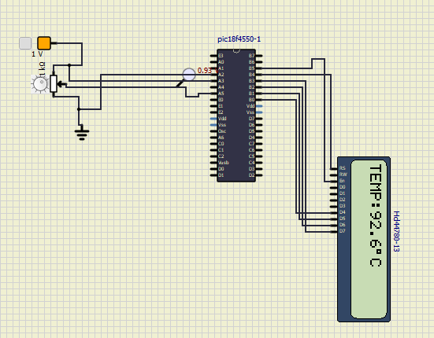
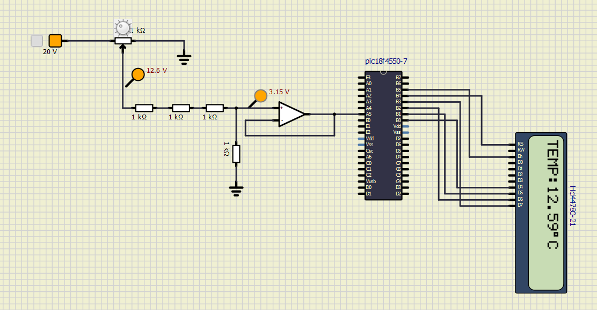

# Projeto 3 - Aplicação de Microprocessadores

## Termômetro Digital com LM35 e Conversor A/D

### Sobre o programa

Desenvolvimento de um Termômetro Digital com LM35 usando o microcontrolador PIC18F4550. O foco é a utilização do compilador MikroC PRO for Pic e dessa forma desenvolver uma aplicação com dados analógicos, com ênfase no módulo ADC (conversor analógico-digital) e na interface com display LCD. 

### Objetivos
 * Familiarização com Compiladores e Programação em Linguagem C
 * Utilização do Módulo ADC e Interface com Display LCD
 * Implementação Prática com LM35
 * Simular usando o SimulIDE para ver se está correto

### Resultados

O programa foi desenvolvido em linguagem C usando o compilador MikroC PRO for PIC. Abaixo está um resumo das principais configurações e funções utilizadas:

1. Configuração do Módulo ADC:

   * O módulo ADC foi inicializado usando a função ADC_Init().

   * O registrador ADCON1 foi configurado para usar uma alimentação externa de 1V nos canais AN2 e AN3, respectivamente A2 e A3 no SimulIDE, simulando a faixa de 0 a 100 °C do LM35.

1. Leitura Analógica:

   * A função ADC_Get_Sample(4) foi utilizada para ler o valor analógico do canal AN4, no simulador essa é a entrada A5.

   * O valor lido foi escalonado para a faixa de 0 a 100 °C.

1. Exibição no Display LCD:

   * O valor de temperatura foi formatado para exibir três algarismos significativos (XX.X °C).

   * A função Lcd_Out() foi usada para exibir o valor no display LCD.
  

## Projeto de um Voltímetro Digital com Microcontrolador PIC

### Introdução
Este projeto tem como objetivo desenvolver um voltímetro digital utilizando um microcontrolador PIC que leia uma tensão de entrada de 0 a 20 V e exiba o valor correspondente em um display LCD. O projeto foi implementado no SimulIDE e simulado usando o software MikroC PRO for PIC.

### Resultados

#### Cálculo do Divisor de Tensão
Para adaptar a faixa de 0 a 20 V para 0 a 5 V, utilizamos um divisor de tensão com resistores R1 e R2. A relação entre os resistores é dada por:

$V_{out}=V_{in} * \frac{R2}{R1+R2}$

Para $V_{out} = 5V$ e $V_{in} = 20V$

$5 =20 * \frac{R2}{R1+R2}$

Resolvendo para $R1$ e $R2$:

$R1=3R2$

Escolhemos valores comerciais para R1 e R2, por exemplo, $R1 = 3kΩ$ e $R2 = 1kΩ$, na qual o resistor R1 foi possível colocando 3 resistore de $1kΩ$ em série.

| Autor                          | NUSP      |
| ------------------------------ | --------- |
| Aruan Bretas de Oliveira Filho | 12609731  |
| Johnatas Santos                | 13676388  |
| Gabriel Garcia                 | 13677160  |
