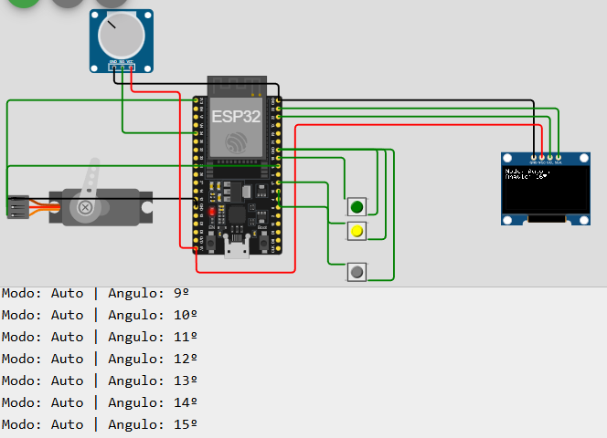
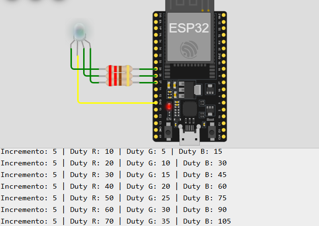

| Autor                          | NUSP      |
| ------------------------------ | --------- |
| Aruan Bretas de Oliveira Filho | 12609731  |
| Johnatas Santos                | 13676388  |
| Gabriel Garcia                 | 13677160  |

# Projeto 4 - Aplicação de Microprocessadores

## **Programa 1: Controle PWM e Comunicação com ESP32**

### **Descrição do Projeto**
Este programa implementa o controle de um **servo motor** utilizando a técnica **PWM** e a comunicação com um **display OLED**. A aplicação permite dois modos de operação (automático e manual) e uma opção para desligar o sistema, conforme os requisitos.


### **Funcionalidades**
1. **Modo Automático**:
   - O servo motor se move de **0° a 180°** em incrementos de **1° a cada 100 ms**.
   - Ao atingir **180°**, o servo espera **1 segundo** e retorna a **0°** em passos de **200 ms**.
   - O processo inicia **apenas após pressionar o botão LOOP**.

2. **Modo Manual**:
   - O ângulo do servo motor é controlado manualmente usando um **potenciômetro**.
   - O valor analógico lido é convertido para um ângulo entre **0° e 180°**.

3. **Desligamento do Sistema**:
   - Um botão dedicado para **desligar** o sistema, interrompendo qualquer movimento do servo motor.

4. **Exibição de Informações**:
   - As informações do **modo atual** e do **ângulo do servo** são exibidas no **Display OLED** e no **Monitor Serial**.


### **Componentes Utilizados**
1. **ESP32** (microcontrolador).
2. **Servo Motor** (PWM controlado entre 500 e 2500 µs).
3. **Display OLED** (128x64, comunicação I2C).
4. **Botões**:
   - **BUTTON_LOOP**: Inicia o modo automático.
   - **BUTTON_MANUAL**: Inicia o modo manual.
   - **BUTTON_OFF**: Desliga o sistema.
5. **Potenciômetro** (para controle manual do ângulo).
6. **Resistores e jumpers** (para montagem no simulador Wokwi).


### **Diagrama de Pinos**

| **Componente**       | **Pino ESP32** | **Descrição**                 |
|-----------------------|----------------|--------------------------------|
| Servo Motor           | 18             | Pino PWM                      |
| Botão LOOP            | 19             | Inicia modo automático         |
| Botão MANUAL          | 16             | Inicia modo manual             |
| Botão OFF             | 17             | Desliga o sistema              |
| Potenciômetro         | 34             | Leitura analógica (ADC)        |
| SDA (Display OLED)    | 23             | Comunicação I2C - SDA          |
| SCL (Display OLED)    | 22             | Comunicação I2C - SCL          |




### **Bibliotecas Utilizadas**
- **ESP32Servo**: Para controle PWM do servo motor.
- **Wire**: Para comunicação I2C com o display OLED.
- **Adafruit_GFX** e **Adafruit_SSD1306**: Para exibição de informações no display OLED.


### **Código Desenvolvido**

```cpp
#include <ESP32Servo.h>
#include <Wire.h>
#include <Adafruit_GFX.h>
#include <Adafruit_SSD1306.h>

// Definições de pinos
#define SERVO_PIN 18       // Pino PWM para o servo motor
#define BUTTON_LOOP 19     // Botão para iniciar o modo automático
#define BUTTON_MANUAL 16  // Botão para iniciar o modo manual
#define BUTTON_OFF 17      // Botão para desligar o sistema
#define POTENTIOMETER 34   // Pino ADC para o potenciômetro
#define SDA_PIN 23         // Pino SDA para o display OLED
#define SCL_PIN 22         // Pino SCL para o display OLED

// Configuração do display OLED
#define SCREEN_WIDTH 128
#define SCREEN_HEIGHT 64
Adafruit_SSD1306 display(SCREEN_WIDTH, SCREEN_HEIGHT, &Wire, -1);

Servo myServo;

// Variáveis globais
int angle = 0;
bool autoMode = false;
bool manualMode = false;
bool systemOff = false;
bool upping = true;

void setup() {
  Serial.begin(115200);

  // Configuração dos botões
  pinMode(BUTTON_LOOP, INPUT_PULLUP);
  pinMode(BUTTON_MANUAL, INPUT_PULLUP);
  pinMode(BUTTON_OFF, INPUT_PULLUP);

  Wire.begin(SDA_PIN, SCL_PIN);
  // Configuração do servo motor
  myServo.attach(SERVO_PIN, 500, 2500); // Frequência de 50 Hz e range de 500 a 2500 µs

  // Configuração do display OLED
  if(!display.begin(SSD1306_SWITCHCAPVCC, 0x3C)) {
    Serial.println(F("SSD1306 allocation failed"));
    for(;;);
  }
  display.clearDisplay();
  display.setTextSize(1);
  display.setTextColor(WHITE);
  display.setCursor(0, 0);
  display.println("Sistema Inicializado");
  display.display();

  // Inicialização do servo motor
  myServo.write(0);
  angle = 0;
}

void loop() {
  // Verifica o estado dos botões
  if (digitalRead(BUTTON_LOOP) == LOW) {
    autoMode = true;
    manualMode = false;
    systemOff = false;
    Serial.println("BOTAO LOOP");
    delay(200); // Debounce
  }

  if (digitalRead(BUTTON_MANUAL) == LOW) {
    manualMode = true;
    autoMode = false;
    systemOff = false;
    Serial.println("BOTAO MANUAL");

    delay(200); // Debounce
  }


  if (digitalRead(BUTTON_OFF) == LOW) {
    systemOff = true;
    autoMode = false;
    manualMode = false;
    myServo.write(0);
    display.clearDisplay();
    display.setCursor(0, 0);
    display.println("Sistema Desligado");
    display.display();
    Serial.println("BOTAO OFF");
    delay(200); // Debounce
  }

  // Modo automático
  if (autoMode && !systemOff) {
    if(angle == 180){
      upping = false;
      delay(1000);
    }

    if (angle ==0)
      upping = true;

    if(upping){
      angle ++;
      delay(100);
    }else{
      angle --;
      delay(200);
    }

    myServo.write(angle);
    displayAngle(angle, "Auto");
  }

  // Modo manual
  if (manualMode && !systemOff) {
    int potValue = analogRead(POTENTIOMETER);
    angle = map(potValue, 0, 4095, 0, 180); // Mapeia o valor do ADC para ângulo do servo
    myServo.write(angle);
    displayAngle(angle, "Manual");
    delay(50);
  }

}

void displayAngle(int angle, String mode) {
    display.clearDisplay();
    display.setCursor(0, 0);
    display.print("Modo: ");
    display.println(mode);
    display.print("Angulo: ");
    display.print(angle);
    display.print((char)247);
    display.fillCircle(display.getCursorX() + 2, display.getCursorY() - 3, 1, WHITE);

    display.display();
    Serial.print("Modo: ");
    Serial.print(mode);
    Serial.print(" | Angulo: ");
    Serial.print(angle);
    Serial.println("º");
}
```

### Resultado da execução
1. **Modo Automático** representado pelo botão conectado ao pino 19, faz com que o sistema opere o modo automático aumentando o ângulo com um timer
2. **Modo Manual** representado pelo pino botão conectado ao pino 16, faz com que o sistema entre em modo manual, controlando o ângulo através de um potenciômetro
3. **Botão de Desligar** Encerra a execução

### **Ferramentas Utilizadas**
- **Simulador Wokwi**: Para teste e simulação.
- **ESP32 Devkit**: Microcontrolador utilizado.
- **Framework Arduino IDE**: Ambiente de desenvolvimento.

### **Execução**
1. Configure os pinos conforme descrito e ilustrado.
2. Carregue o código na ESP32 caso não for trabalhar no simulador.
3. Utilize os botões para alternar entre os modos e o potenciômetro para controle manual.


## **Projeto 4 - Programa 2: Controle PWM de LED RGB com ESP32 (ESP-IDF)**

### **Descrição do Projeto**
Este programa implementa o controle de um **LED RGB** utilizando **PWM** (Pulse Width Modulation) através da biblioteca **LEDC** do ESP-IDF. O programa ajusta os valores de **duty cycle** para cada cor do LED (R, G e B) em incrementos específicos, criando um efeito de modulação de cores.


### **Funcionalidades**
1. **Controle PWM**:
   - O brilho de cada cor (R, G, B) é controlado individualmente com **resolução de 8 bits** (0-255).
   - A frequência do PWM é configurada em **5 kHz**.

2. **Incremento de Duty Cycle**:
   - Os valores do **duty cycle** aumentam em incrementos distintos:
     - **R = PWM_INCREMENT * 2**
     - **G = PWM_INCREMENT**
     - **B = PWM_INCREMENT * 3**
   - Os valores são atualizados em um **loop a cada 100 ms**.

3. **Monitor Serial**:
   - Exibe o valor do incremento e os **duty cycles** atuais de cada cor (R, G, B).


### **Componentes Utilizados**
1. **ESP32 Devkit** (microcontrolador).
2. **LED RGB** de **cátodo comum**.
3. **Resistores de 220 ohms** para cada terminal do LED.
4. **Protoboard e jumpers** para montagem.


### **Diagrama de Pinos**

| **Componente**       | **Pino ESP32** | **Descrição**                 |
|-----------------------|----------------|--------------------------------|
| LED Vermelho (R)      | 25             | Canal PWM para o LED R         |
| LED Verde (G)         | 26             | Canal PWM para o LED G         |
| LED Azul (B)          | 27             | Canal PWM para o LED B         |

segue a imagem abaixo



### **Bibliotecas Utilizadas**
- **freertos/FreeRTOS.h**: Para gerenciamento de tarefas.
- **driver/ledc.h**: Biblioteca para controle PWM usando o módulo LEDC do ESP32.


### **Código Principal**

```c
#include <stdio.h>
#include "freertos/FreeRTOS.h"
#include "freertos/task.h"
#include "driver/ledc.h"

// Definição dos pinos GPIO
#define LED_R_PIN 25 // Pino para o LED Vermelho
#define LED_G_PIN 26 // Pino para o LED Verde
#define LED_B_PIN 27 // Pino para o LED Azul

// Parâmetros PWM
#define PWM_FREQUENCY 5000  // Frequência do PWM em Hz
#define PWM_RESOLUTION LEDC_TIMER_8_BIT  // Resolução de 8 bits (0-255)
#define PWM_INCREMENT 5  // Valor de incremento do duty cycle

// Definição dos canais PWM
#define LEDC_TIMER LEDC_TIMER_0
#define LEDC_MODE LEDC_LOW_SPEED_MODE
#define CHANNEL_R LEDC_CHANNEL_0
#define CHANNEL_G LEDC_CHANNEL_1
#define CHANNEL_B LEDC_CHANNEL_2

// Configuração inicial do LEDC
void configure_ledc()
{
    // Configuração do timer
    ledc_timer_config_t ledc_timer = {
        .speed_mode = LEDC_MODE,
        .timer_num = LEDC_TIMER,
        .duty_resolution = PWM_RESOLUTION,
        .freq_hz = PWM_FREQUENCY,
        .clk_cfg = LEDC_AUTO_CLK,
    };
    ledc_timer_config(&ledc_timer);

    // Configuração dos canais PWM para R, G e B
    ledc_channel_config_t ledc_channel[3] = {
        {
            .speed_mode = LEDC_MODE,
            .channel = CHANNEL_R,
            .timer_sel = LEDC_TIMER,
            .intr_type = LEDC_INTR_DISABLE,
            .gpio_num = LED_R_PIN,
            .duty = 0,
            .hpoint = 0,
        },
        {
            .speed_mode = LEDC_MODE,
            .channel = CHANNEL_G,
            .timer_sel = LEDC_TIMER,
            .intr_type = LEDC_INTR_DISABLE,
            .gpio_num = LED_G_PIN,
            .duty = 0,
            .hpoint = 0,
        },
        {
            .speed_mode = LEDC_MODE,
            .channel = CHANNEL_B,
            .timer_sel = LEDC_TIMER,
            .intr_type = LEDC_INTR_DISABLE,
            .gpio_num = LED_B_PIN,
            .duty = 0,
            .hpoint = 0,
        }
    };

    // Configuração dos canais no LEDC
    for (int i = 0; i < 3; i++) {
        ledc_channel_config(&ledc_channel[i]);
    }
}

// Função principal de controle PWM
void led_pwm_control(void *pvParameters)
{
    uint8_t duty_r = 0;
    uint8_t duty_g = 0;
    uint8_t duty_b = 0;

    while (1) {
        // Atualiza os duty cycles de cada cor com os incrementos
        duty_r = (duty_r + PWM_INCREMENT * 2) % 256;
        duty_g = (duty_g + PWM_INCREMENT) % 256;
        duty_b = (duty_b + PWM_INCREMENT * 3) % 256;

        // Define os valores de duty cycle nos canais PWM
        ledc_set_duty(LEDC_MODE, CHANNEL_R, duty_r);
        ledc_update_duty(LEDC_MODE, CHANNEL_R);

        ledc_set_duty(LEDC_MODE, CHANNEL_G, duty_g);
        ledc_update_duty(LEDC_MODE, CHANNEL_G);

        ledc_set_duty(LEDC_MODE, CHANNEL_B, duty_b);
        ledc_update_duty(LEDC_MODE, CHANNEL_B);

        // Exibe informações no Monitor Serial
        printf("Incremento: %d | Duty R: %d | Duty G: %d | Duty B: %d\n",
               PWM_INCREMENT, duty_r, duty_g, duty_b);

        // Aguarda 100ms antes de atualizar os valores
        vTaskDelay(pdMS_TO_TICKS(100));
    }
}

void app_main()
{
    // Configura os pinos PWM do LED RGB
    configure_ledc();

    // Cria a tarefa de controle PWM
    xTaskCreate(led_pwm_control, "LED PWM Control", 2048, NULL, 5, NULL);
}
```

Os códigos estarão disponiveis dentro desse repositório do GitHub compactados em ZIP com o projeto do Espressif IDE, usamos a extensão do Visual Studio Code para o desenvolvimento além da simulação no Wokwi


### **Resultados Obtidos**
1. O **LED RGB** exibe uma modulação de cores dinâmica com base nos incrementos definidos.
2. Os valores do **duty cycle** para cada cor são exibidos no **Monitor Serial**:
   ```
   Incremento: 5 | Duty R: 10 | Duty G: 5 | Duty B: 15
   Incremento: 5 | Duty R: 20 | Duty G: 10 | Duty B: 30
   ```


### **Ferramentas Utilizadas**
- **Visual Studio Code**: IDE de desenvolvimento.
- **Extensão ESP-IDF**: Para compilação e upload do código.
- **ESP32 Devkit**: Hardware utilizado.
- **Monitor Serial**: Para exibir valores de incremento e duty cycle.


### **Execução**
1. Configure os pinos GPIO conforme descrito.
2. Compile e carregue o código no ESP32 utilizando o **ESP-IDF**.
3. Observe o comportamento do LED RGB e os logs no **Monitor Serial**.

